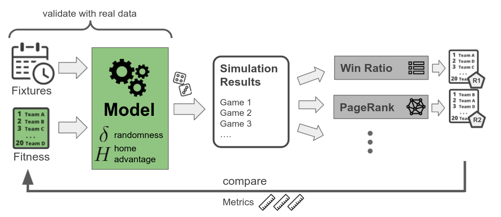
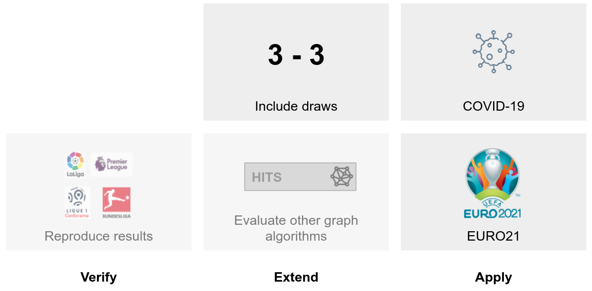

<!--
*** Thanks for checking out the Best-README-Template. If you have a suggestion
*** that would make this better, please fork the repo and create a pull request
*** or simply open an issue with the tag "enhancement".
*** Thanks again! Now go create something AMAZING! :D
-->


<!-- PROJECT SHIELDS -->
<!--
*** I'm using markdown "reference style" links for readability.
*** Reference links are enclosed in brackets [ ] instead of parentheses ( ).
*** See the bottom of this document for the declaration of the reference variables
*** for contributors-url, forks-url, etc. This is an optional, concise syntax you may use.
*** https://www.markdownguide.org/basic-syntax/#reference-style-links
-->
[![Contributors][contributors-shield]][contributors-url]
[![MIT License][license-shield]][license-url]


<!-- PROJECT LOGO -->
<br />
<p align="center">
  <a href="https://www.flaticon.com/authors/becris">
      
  </a>

  <h2 align="center">Applied Network Science: Sports Networks</h2>
  <h3 align="center">Limits of PageRank-based ranking methods in sports data </h3> 
</p>

<!-- TABLE OF CONTENTS -->
<details open="open"> 
  <summary>Table of Contents</summary>
  <ol>
    <li>
      <a href="#about-the-project">About The Project</a>
      <ul>
        <li><a href="#built-with">Built With</a></li>
      </ul>
    </li>
    <li>
      <a href="#getting-started">Getting Started</a>
      <ul>
        <li><a href="#prerequisites">Prerequisites</a></li>
        <li><a href="#installation">Installation</a></li>
      </ul>
    </li>
    <li><a href="#usage">Usage</a></li>
    <li><a href="#license">License</a></li>
    <li><a href="#contact">Contact</a></li>
    <li><a href="#acknowledgements">Acknowledgements</a></li>
  </ol>
</details>


<!-- ABOUT THE PROJECT -->
## About The Project

The project builds on the paper [Limits of PageRank-based ranking methods in sports data](https://arxiv.org/abs/2012.06366) by Yuhao Zhou, Ruijie Wang, Yi-Cheng Zhang, An Zeng, and Matúš Medo.

The authors propose a new approach to evaluate algorithms for ranking sports teams.
Based on an artificial ground truth ranking (fitness values), they introduce a model to simulate the outcome of games.
The model includes one variable for the home advantage and one for the randomness factor of the sport.
The simulated sports results are then used to evaluate different ranking algorithms by comparing their ranking to the ground truth.





As part of the course [Applied Network Science: Sports Networks](http://www.vvz.ethz.ch/Vorlesungsverzeichnis/lerneinheit.view?lerneinheitId=136857&semkez=2020S&ansicht=KATALOGDATEN&lang=en) from ETH Zürich, we add the following contributions to the original work from Zhou et al.:
* reproducing the main results (figures) of the paper
* extending the model of the paper to incorporate draws
* experimenting with the [HITS](https://en.wikipedia.org/wiki/HITS_algorithm) and BiHITS algorithm
* looking at the home advantage of the model during the COVID-19 pandemic
* using the model to simulate the EURO2021




### Built With

The project uses Python in an interactive JupyterLab notebook. 
* [Python](https://www.python.org/)
* [JupyterLab](https://jupyterlab.readthedocs.io/en/stable/)


<!-- GETTING STARTED -->
## Getting Started

Follow these simple example steps to set up the project locally.

### Prerequisites

Before starting, ensure that you have `pipenv` installed:

```sh
pip install pipenv
```

### Installation

1. Clone the repo
```sh
git clone https://github.com/nicolas-kuechler/eth-sports-networks-2021.git
```

2. Install the Python packages
```sh
pipenv install
```

3. Start The Jupyter Lab
```
pipenv run jupyter lab
```

4. Open `project.ipynb` and ensure that the sports-networks kernel is selected.

5. Follow the instructions in the notebook to execute all cells in the proper order (including the collapsed cells).

<!-- USAGE EXAMPLES -->
## Usage


We specify experiments with a Python config dictionary and use the function `build_df(config)` to run the experiments and build a Panda data frame that contains the results.

In the example below, we use 30 teams and repeat the experiments for linear and non-linear fitness values. We use the softmax model with the specified home advantage `H` and randomness `delta`.
Here, we repeat experiments for 10%, 30%, and 80% of the games played, and we don't remove any unexpected results. 
Further, the config repeats each experiment 100 times and uses five different ranking algorithms and three metrics.
Finally, the config specifies using a random round-robin algorithm for the schedule and sample a new schedule in each repetition. 

```python

config = {
    "n_teams": [30],
    "fitness": [{"type": "linear"}, 
                {"type": "nonlinear", "alpha": [1], "beta":[0.4], "gamma": ["fix"] }],
    "model": [{"type": "softmax", "H": [0.1875], "delta": [0.25] }],
    "fraction_games_per_season":  [0.1, 0.3, 0.8], # P in paper (can only be between [0,1])
    "remove_unexpected": [{"mode": ["removal"], "fraction_eta": [0.0]}],
    "n_seasons": 100, # number of repetitions
    "ranking_algos": ["pagerank", "bipagerank", "winratio", "hits", "bihits"],
    "metrics": ["top5_avg_rank", "kendall", "auc"],
    "fix_schedule_over_season": False,
    "schedule": "roundrobin" # options: ["graph","roundrobin"]
}

df = build_df(config)

```

You can find the configurations used for reproducing the results of the paper and running additional experiments in the [notebook](project.ipynb).

### Caching
To avoid expensive re-computation of generated synthetic data, we provide the option to persist generated data to disk in JSON files.
You can enable this local caching of experiment results with the `USE_CACHED_SYNTHETIC_DATA` flag in the first cell of the notebook.

<!-- LICENSE -->
## License

This project's code is distributed under the MIT License. See `LICENSE` for more information.


<!-- CONTACT -->
## Contact

* Hidde Lycklama - [hiddely](https://github.com/hiddely)
* Nicolas Küchler - [nicolas-kuechler](https://github.com/nicolas-kuechler)
* Sivahari Sivakumaran - [Ssivakuma](https://github.com/Ssivakuma)


Project Link: [https://github.com/nicolas-kuechler/eth-sports-networks-2021](https://github.com/nicolas-kuechler/eth-sports-networks-2021)


<!-- ACKNOWLEDGEMENTS -->
## Acknowledgements

Thanks to [Prof. Ulrik Brandes](https://sn.ethz.ch/profile.html?persid=239462) for hosting the course and our supervisor [Wei Zhang](https://sn.ethz.ch/profile.html?persid=283222) for the valuable feedback. 


<!-- MARKDOWN LINKS & IMAGES -->
<!-- https://www.markdownguide.org/basic-syntax/#reference-style-links -->
[contributors-shield]: https://img.shields.io/github/contributors/nicolas-kuechler/eth-sports-networks-2021.svg?style=for-the-badge
[contributors-url]: https://github.com/nicolas-kuechler/eth-sports-networks-2021/graphs/contributors
[license-shield]: https://img.shields.io/github/license/othneildrew/Best-README-Template.svg?style=for-the-badge
[license-url]: https://github.com/nicolas-kuechler/eth-sports-networks-2021/blob/main/LICENSE
